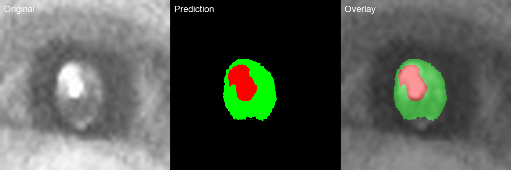
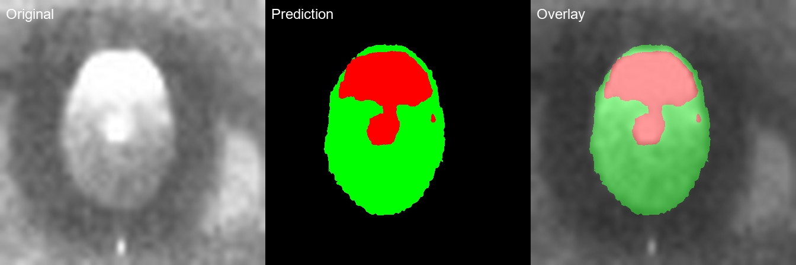
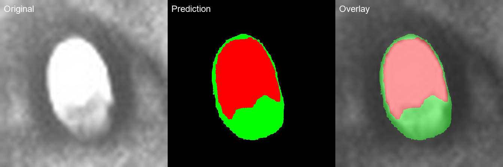

# Eye Fundus Image Segmentation

<div align="center">

[](https://pypi.org/project/ophthalmic-segmentation/)
[](https://pypi.org)
[](LICENSE)
[](docs/results.md)

**High-accuracy UNet++ 眼底图像分割模型 for multi-class retinal image segmentation.**

[English](README.md) | [中文](README_zh.md)

</div>

---

## ✨ Features

- **High Accuracy**: Val Dice = **0.9554** (V16 with hot-start from V13)
- **Multi-class Segmentation**: Background, ROI (Retinal Region), Valid Reflex
- **V16 Training Script**: Complete training with Combined Loss (Focal + Dice + Lovasz)
- **4-Direction TTA**: Test-Time Augmentation for robust predictions
- **Hot-Start Training**: Start from V13 pretrained weights for faster convergence
- **Pre-trained Models**: Ready-to-use checkpoints
- **Real Model Inference**: Load trained model and predict on new images

## 📊 Performance

| Metric | Score |
|--------|-------|
| Val Dice (no TTA) | **0.9554** |
| Val Dice (4x TTA) | **0.9398** |
| ROI Dice | 0.9282 |
| Reflex Dice | 0.9660 |

## 🖼️ Example Results

Real segmentation results from the v16 model:

<table>
<tr>
<td align="center"><b>Original</b></td>
<td align="center"><b>Prediction Mask</b></td>
<td align="center"><b>Overlay</b></td>
</tr>
<tr>
<td colspan="3">



</td>
</tr>
<tr>
<td colspan="3">



</td>
</tr>
<tr>
<td colspan="3">



</td>
</tr>
</table>

More examples: [examples/](https://github.com/FeiFeiAlbert/ophthalmic-segmentation/tree/main/examples)

## 🏗️ Architecture

```
UNet++ with EfficientNet-B4 encoder
├── Input: 448×448×3 RGB image
├── Encoder: EfficientNet-B4 (ImageNet pretrained)
├── Decoder: UNet++ dense skip connections
└── Output: 448×448×3 segmentation mask
    ├── Class 0: Background (black)
    ├── Class 1: ROI - Retinal Region (green)
    └── Class 2: Valid Reflex (red)
```

## 🔧 Installation

```bash
pip install ophthalmic-segmentation
```

Or install from source:

```bash
git clone https://github.com/FeiFeiAlbert/ophthalmic-segmentation.git
cd ophthalmic-segmentation
pip install -e .
```

### Dependencies

```
torch >= 2.0.0
torchvision >= 0.15.0
segmentation-models-pytorch >= 0.3.3
albumentations >= 1.3.1
opencv-python >= 4.8.0
pillow >= 10.0.0
matplotlib >= 3.7.0
numpy >= 1.24.0
tqdm >= 4.65.0
```

## 🚀 Quick Start

### 1. Use Pre-trained Model (Recommended)

```python
import torch
from ophthalmic_segmentation.model import create_model
from ophthalmic_segmentation import FundusSegmenter

# Create model
segmenter = FundusSegmenter.create_model(
    architecture='unetpp', 
    encoder='efficientnet-b4', 
    num_classes=3
)

# Load pretrained weights
segmenter.load_checkpoint('checkpoints/best_model.pth')

# Predict on image
from PIL import Image
image = Image.open('path/to/fundus_image.jpg')
mask = segmenter.predict(image, input_size=448, apply_tta=True)

# Visualize
overlay = segmenter.visualize(image, mask, alpha=0.5)
```

### 2. Train Your Own Model (V16)

Train from scratch or with hot-start from V13:

```bash
# Train with V16 (from scratch, ImageNet pretrained encoder)
python scripts/train_v16.py \
    --data_dir ./data \
    --img_size 448 \
    --batch_size 4 \
    --epochs 200 \
    --save_dir checkpoints

# Train with hot-start from V13 weights
python scripts/train_v16.py \
    --data_dir ./data \
    --pretrained checkpoints_v13/best_model.pth \
    --img_size 448 \
    --batch_size 4 \
    --epochs 200 \
    --save_dir checkpoints_v16
```

**V16 Key Features:**
- Combined Loss: 0.3×Focal + 0.4×Dice + 0.3×Lovasz
- Differential Learning Rates: encoder=1e-5, decoder=1e-4
- CosineAnnealingWarmRestarts scheduler (T₀=50, T_mult=2)
- 4-direction TTA validation
- Early stopping with patience=50

### 3. Run Inference

```bash
# Single image inference with TTA
python scripts/predict.py \
    --model checkpoints/best_model.pth \
    --input path/to/image.jpg \
    --output result.png

# Batch processing
python scripts/predict.py \
    --model checkpoints/best_model.pth \
    --input data/images/ \
    --output results/

# Without TTA (faster but less accurate)
python scripts/predict.py \
    --model checkpoints/best_model.pth \
    --input image.jpg \
    --output result.png \
    --no-tta
```

## 📂 Project Structure

```
ophthalmic-segmentation/
├── README.md
├── README_zh.md
├── LICENSE (MIT)
├── requirements.txt
├── setup.py
├── examples/              # Example segmentation results
│   ├── example_1.png
│   ├── example_2.png
│   └── example_3.png
├── ophthalmic_segmentation/
│   ├── __init__.py         # Package exports
│   ├── model.py            # Model definition (UNet++, DeepLabV3+, etc.)
│   ├── data.py             # Dataset class with augmentation
│   ├── losses.py           # Focal, Dice, Lovasz, CombinedLoss
│   └── utils.py            # Utility functions
├── scripts/
│   ├── train_v16.py        # V16 training script (FULL version)
│   ├── train.py             # Simplified training script
│   └── predict.py           # V16 inference script
├── checkpoints/
│   └── best_model.pth      # Pre-trained weights (V16)
├── docs/
│   ├── training_report.md   # Detailed training log
│   └── results.md          # Evaluation results
└── tests/
    └── test_model.py       # Unit tests
```

## 📖 Documentation

- [Training Report](docs/training_report.md) - Detailed V16 training process and results
- [Results Analysis](docs/results.md) - Performance metrics and comparisons
- [Examples](examples/) - Visual segmentation results

## 🔬 Segmentation Classes

| Class | Color | Description |
|-------|-------|-------------|
| 0: Background | Black | Non-retinal regions |
| 1: ROI | Green | Retinal region of interest |
| 2: Valid Reflex | Red | Valid red reflex area |

## 📜 Citation

If this project helps your research, please cite:

```bibtex
@misc{ophthalmic-segmentation,
  title={Ophthalmic Fundus Image Segmentation with UNet++},
  author={Albert Long},
  year={2026},
  howpublished={\url{https://github.com/FeiFeiAlbert/ophthalmic-segmentation}}
}
```

## 📄 License

This project is licensed under the MIT License - see the [LICENSE](LICENSE) file for details.

## 🙏 Acknowledgments

- [segmentation-models-pytorch](https://github.com/qubvel/segmentation-models.pytorch)
- [EfficientNet](https://arxiv.org/abs/1905.11946)
- [UNet++](https://arxiv.org/abs/1912.05074)
- [Lovasz Loss](https://github.com/bermanmaxim/LovaszSoftmax)
